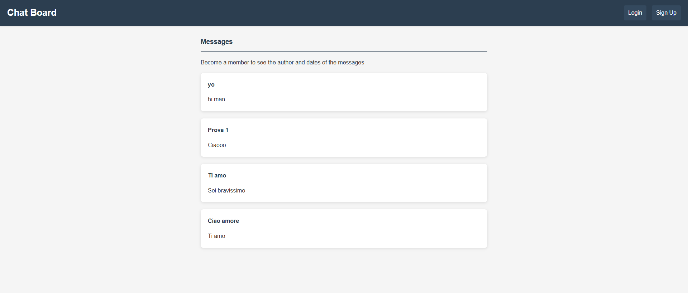
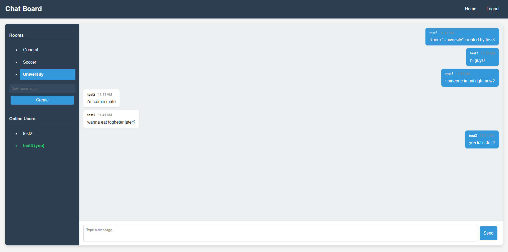
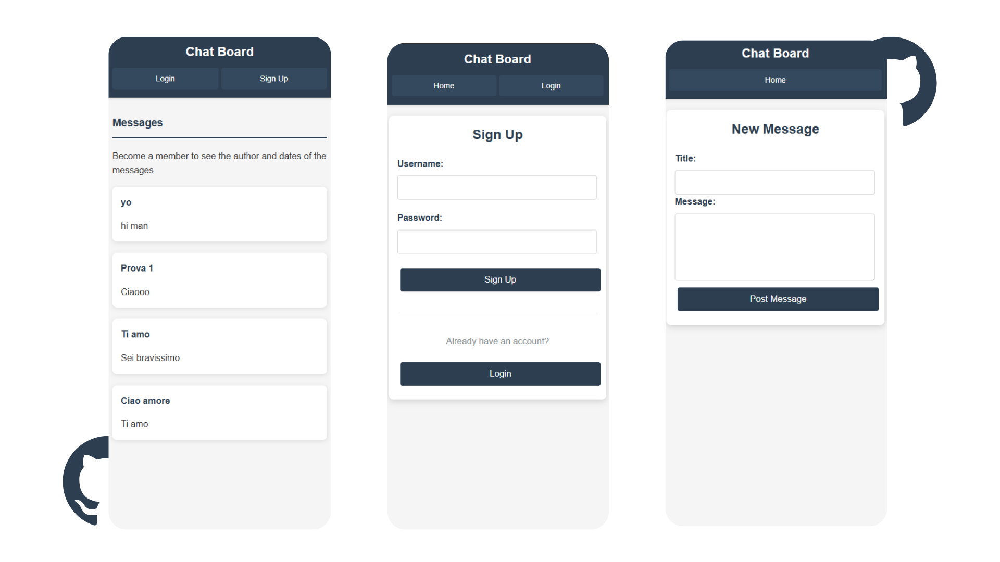

# Chat-Board 2.0: Secure Distributed Messaging

"ChatBoard" is a private clubhouse where visitors can view messages, but only registered members can post content and see creator information. Members enjoy a real-time chat system with public and custom rooms for immediate interaction.

This project started as a monolithic Node.js chat toy app and was redesigned as a distributed, security-focused system.

It now showcases four production-style engineering themes:

1. Distributed infrastructure with NGINX load balancing and Dockerized multi-instance Node services.
2. Horizontal WebSocket scaling with Redis Pub/Sub and shared online presence.
3. High-read optimization with Redis write-through caching for room history.
4. End-to-end encrypted chat payloads using browser-side Web Crypto, with ciphertext-only storage in MongoDB.

## Tech Stack

- Node.js
- Express
- Socket.IO
- Redis
- MongoDB + Mongoose
- NGINX
- Docker + Docker Compose
- Web Crypto API (browser)

## Screenshots





## Final Architecture

The runtime topology is:

1. NGINX container as reverse proxy and load balancer.
2. Two backend app containers (`app1`, `app2`) running the same Node.js service.
3. One Redis container used for:
   - Socket.IO adapter Pub/Sub
   - global online user state via Redis Sets
   - message cache via Redis Lists
4. MongoDB (external URI) for persistent user and message data.

Traffic flow:

1. Browser connects to NGINX on port 80 or 8080.
2. NGINX forwards HTTP and WebSocket traffic to either app instance using sticky sessions (`ip_hash`).
3. Socket.IO Redis adapter propagates events across both app instances.
4. Messages persist in MongoDB and are cached in Redis.
5. Message content is encrypted in the browser before being sent.

## Basic Features

1. User authentication with passportJS.
2. Live chat implemented using Socket.Io.
3. Securing passwords using bcryptjs.
4. Schema validation using Mongoose.

## Local Run and Demo

This project is intentionally local-demo focused and not deployed publicly.

1. Create `.env` in project root:

```bash
MONGO_URI='your_mongodb_connection_string'
# Optional backward-compatible alias:
# MONGODB_URI='your_mongodb_connection_string'
```

2. Build and start cluster:

```bash
docker compose up -d --build
```

3. Open app:

```text
http://localhost:8080
```

4. Demo checklist:

1. Register two users in two different browsers (or browser + private tab).
2. Open chat room in both sessions.
3. Send messages both ways and verify both clients can read decrypted text.
4. Inspect MongoDB and confirm `message` field stores encrypted payload, not plaintext.
5. (Optional) Check Redis cache size for room history:

```bash
docker exec -it chat_redis redis-cli LLEN room:general:messages
```

## Security Model Summary

What this protects:

1. Database compromise exposure is reduced because message content at rest is encrypted.
2. Backend operators do not need plaintext to store and relay messages.

Current practical limitation:

1. Key envelope coverage is based on available recipients at send time.
2. A user who was not included in older message envelopes may not decrypt older history.

Planned hardening path:

1. Persist room membership key envelopes per user (server stores encrypted key blobs only).
2. Allow member devices to recover room keys on login and decrypt full backlog.
