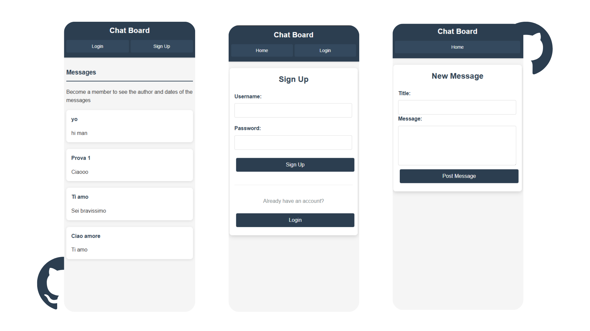

"ChatBoard" is a private clubhouse where visitors can view messages, but only registered members can post content and see creator information. Members enjoy a real-time chat system with public and custom rooms for immediate interaction.

## Built With

- NodeJS
- ExpressJS
- MongoDB
- MongooseJS

## Features

- User authentication with [passportJS](https://www.passportjs.org/)
- Live chat implemented using [Socket.Io](https://socket.io/)
- Securing passwords using [bcryptjs](https://www.npmjs.com/package/bcrypt)
- Schema validation using Mongoose

## Screenshot





### Installation

1. Clone the repository
   ```
   git clone https://github.com/roccocalo/chatboard.git
   cd chatboard
   ```

2. Install dependencies
   ```
   npm install
   ```

3. Create a `.env` file in the root directory with the following variables:
   ```
   MONGODB_URI='your_mongodb_connection_string'
   ```

4. Start the development server
   ```
   npm run dev
   ```

5. Visit `http://localhost:3000` in your browser